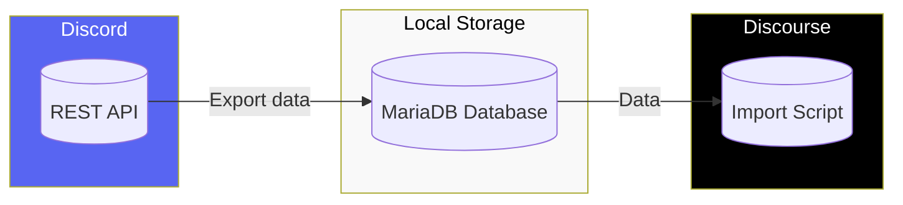

# Discord forum channel to Discourse migration scripts

This repository contains scripts to migrate Discord forum channels to Discourse.

1. [discord-export](discord-export/README.md) exports data from Discord into a local database.
2. [discourse-import](discourse-import/README.md) imports data from the local database into Discourse.

## Requirements

- Discourse server
  - Using [Discourse Docker]()
  - On a [virtual machine](https://gist.github.com/samie/3d9e1d6274be5cbda7e25356a1efcad3) (needed for Arm-based Mac).
- A MySQL or MariaDB database with a user that has access to a database.